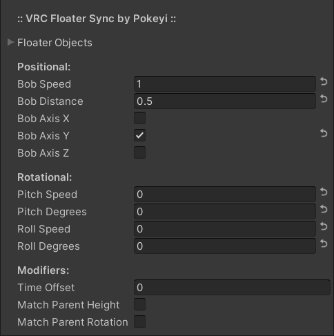

# [💾](https://github.com/Pokeyi/VRC-Floater-Sync/blob/main/P_FloaterSync.cs) VRC-Floater-Sync 
UTC-synced bobbing and rocking motion for floating objects in VRChat.

### VRChat Creator Companion App (VCC)
***This project can now be imported through VCC with the [Pokeyi's Udon Tools](https://github.com/Pokeyi/vpm-packages#vpm-packages) VPM package.***

## Overview
VRC Floater Sync is a single configurable UdonSharp behaviour that can be used to manage synced bobbing and rocking motions for multiple floating game objects simultaneously synchronized to all players without networking.

It is intended to be efficient and relatively simple to use without the need for any additional editor scripts or dependencies outside of UdonSharp. All configuration can be done within the Unity Inspector window without the need for any programming, Udon, or SDK knowledge. That said, the source code is cleanly-organized and commented in the hopes of also being a good learning tool.

### Requirements
Errors regarding functions not being exposed likely mean you need an updated version of the SDK or UdonSharp.
- [Unity](https://docs.vrchat.com/docs/current-unity-version) (Tested: v2019.4.31f1)
- [VRChat Worlds SDK3](https://vrchat.com/home/download) (Tested: v2021.11.8)
- [UdonSharp](https://github.com/MerlinVR/UdonSharp) (Tested: v0.20.3)

### Recommended
Other useful VRChat world-creation tools that I will always recommend.
- [World Creator Assistant](https://github.com/Varneon/WorldCreatorAssistant) (SDK & Package Management)
- [CyanEmu](https://github.com/CyanLaser/CyanEmu) (Unity-Window Testing)
- [VRWorld Toolkit](https://github.com/oneVR/VRWorldToolkit) (World Debugger)

### Setup
Make sure you have already imported the VRChat Worlds SDK and UdonSharp into your project.
- Download the latest [Unity Package](https://github.com/Pokeyi/VRC-Floater-Sync/releases) and import it into your project.
- A pre-configured example prefab is included that you can drop into your scene if you like.
- Create and select an empty game object and add the P_FloaterSync behaviour via the Unity Inspector window or 'Component > Pokeyi.VRChat > P.VRC Floater Sync' toolbar menu.
- Click the 'Convert to UdonBehaviour' button if prompted.
- Click the small triangle next to Floater Objects to expand the array.
- If the Size field is left at 0, you can lock the Inspector tab and drag the game object(s) you want to manage into the Floater Objects label to add them all to the array at once. You can alternatively enter a Size value and drag them in one at a time.
- Configure the rest of the behaviour's properties in the Inspector window as you see fit. Each of these is explained in detail further below.
- *DO NOT* use a separate copy of this behaviour for every floating object, it is meant to control multiple objects with a single behaviour.

## Features
The main features of Floater Sync.
- Floater Objects - The array of game objects you've selected to be modified by this behaviour.
- Motion Properties - Properties governing positional bobbing and rotational pitch and roll motions.
- Options - Additional options for offset grouping and parent functionality.
- UTC-Sync - The method used for syncing motions to all players. This is done automatically.

All of the following properties have hover-tooltips in the Unity Inspector window.

### Floater Objects
The array of game objects you've selected to be modified by this behaviour. Multiple can be added.
- *DO NOT* use a separate copy of this behaviour for every floating object, it is meant to control multiple objects with a single behaviour.
- There is no limit imposed on the number of game objects you can add.
- See [Setup](#setup) above for tips on placing game objects into the array via the Unity Inspector window.

### Motion Properties
The types and amounts of motion smoothly blended and applied simultaneously to each floater object per cycle.
- Bob Speed - Speed of positional bobbing motion.
- Bob Distance - Distance objects will move in each positional bobbing direction.
- Bob Axis X/Y/Z - Whether to apply positional motion to each axis. Choosing multiple will smoothly combine their movements.
- Pitch Speed - Speed of forward-back pitch motion.
- Pitch Degrees - Angle objects will rotate in each forward-back pitch direction.
- Roll Speed - Speed of left-right roll motion.
- Roll Degrees - Angle objects will rotate in each left-right roll direction.

### Options
Additional options for offset grouping and parent functionality.
- Time Offset - Offset in seconds if you want different object groups synced separately.
- Match Parent Height - Whether you want the floating objects to match the base height of their parent object.
- Match Parent Rotation - Whether you want the floating objects to match the base rotation of their parent object.

### UTC-Sync
UTC-Sync is a method of syncing motions or events for all players without the use of networking by aligning them with Universal Time as a shared frame of reference.
- The only caveat to this form of syncing is that each player's local machine must have had its clock [synchronized](https://youtu.be/VZBxG6v0gYQ). This is usually done automatically by Windows. The latest synchronization can be checked in your Date & Time Settings, but it should be very rare that this would need to be worried about manually.

### Use Case Examples
As of the v1.1.0 update, there are a few more potential use cases for this behaviour.
- Objects bobbing together at a matched height-level, as if they are floating in water.
- Objects floating at different offset heights as if they are hovering in the air.
- Objects moving smoothly on the X or Z axis instead of bobbing up and down, like for moving jumping platforms.

## Credit & Support
Please credit me as Pokeyi if you use my work. I would also love to see your creations that make use of it if you're inclined to share. This and [related projects](https://github.com/Pokeyi/pokeyi.github.io#my-projects) have involved many months of solid work and self-education as I strive for an opportunity to change careers and make a better life for myself. If you find value in my work, please consider supporting me, it would truly help a lot.

## License
This work is licensed under the MIT License.

Copyright © 2022 Pokeyi - https://pokeyi.dev - [pokeyi@pm.me](mailto:pokeyi@pm.me)

Permission is hereby granted, free of charge, to any person obtaining a copy
of this software and associated documentation files (the "Software"), to deal
in the Software without restriction, including without limitation the rights
to use, copy, modify, merge, publish, distribute, sublicense, and/or sell
copies of the Software, and to permit persons to whom the Software is
furnished to do so, subject to the following conditions:

The above copyright notice and this permission notice shall be included in all
copies or substantial portions of the Software.

THE SOFTWARE IS PROVIDED "AS IS", WITHOUT WARRANTY OF ANY KIND, EXPRESS OR
IMPLIED, INCLUDING BUT NOT LIMITED TO THE WARRANTIES OF MERCHANTABILITY,
FITNESS FOR A PARTICULAR PURPOSE AND NONINFRINGEMENT. IN NO EVENT SHALL THE
AUTHORS OR COPYRIGHT HOLDERS BE LIABLE FOR ANY CLAIM, DAMAGES OR OTHER
LIABILITY, WHETHER IN AN ACTION OF CONTRACT, TORT OR OTHERWISE, ARISING FROM,
OUT OF OR IN CONNECTION WITH THE SOFTWARE OR THE USE OR OTHER DEALINGS IN THE
SOFTWARE.
